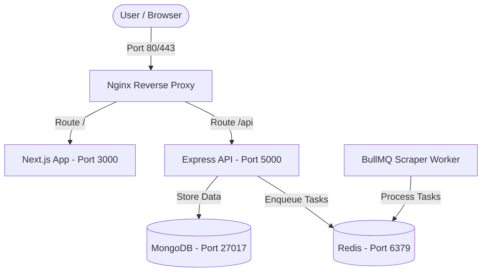
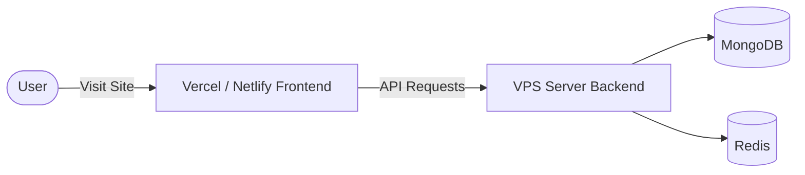

# 🎓 Studivo — Smart Service Marketplace
### استوديفو — منصة الخدمات الطلابية الذكية

Welcome to the comprehensive documentation for **Studivo** (a dashboard control panel for students and advisors). This guide details the project's architecture, core modules, packages breakdown, directory structure, and step-by-step VPS installation & deployment instructions.

---

## 📖 Table of Contents (جدول المحتويات)
1. [🏗️ Platform Overview & Core Concept (نظرة عامة على المنصة)](#%EF%B8%8F-platform-overview--core-concept)
2. [⚙️ Key Features & System Modules (أبرز المميزات وأنظمة العمل)](#%EF%B8%8F-key-features--system-modules)
3. [🛠️ Technology Stack (التقنيات المستخدمة)](#%EF%B8%8F-technology-stack)
4. [📂 Directory & Codebase Structure (هيكل المشروع)](#-directory--codebase-structure)
5. [📦 Backend Packages Breakdown (دليل حزم الخادم)](#-backend-packages-breakdown)
6. [🗺️ Platform Architecture & Proxy Flow (تدفق البيانات والربط)](#%EF%B8%8F-platform-architecture--proxy-flow)
7. [📋 Option 1: Single VPS Server Deployment (النشر الأحادي على سيرفر واحد)](#-option-1-single-vps-server-deployment-monolithic-setup)
8. [🌐 Option 2: Split Server Deployment (النشر المنفصل لواجهة المستخدم والخادم)](#-option-2-split-server-deployment-frontend-and-backend-separated)
9. [📝 Environment Variables Reference (دليل متغيرات البيئة)](#-environment-variables-reference)
10. [📊 Useful Operations & Monitoring (أوامر المراقبة وإدارة التشغيل)](#-useful-operations--monitoring)

---

## 🏗️ Platform Overview & Core Concept
### (نظرة عامة على المنصة وفكرتها الأساسية)

On conventional service marketplaces, service providers list their offerings and clients must browse through thousands of static listings to find a match. **Studivo flips this dynamic on its head.**

In Studivo, the student or client publishes a request outlining exactly what they need (specifying parameters, requirements, subject area, and budget in Egyptian Pounds EGP). The intelligent backend then processes this request:
* Parses raw student inputs using **AI models** to extract structured metadata.
* Dispatches background worker tasks to **scrape external marketplaces** for immediate alternative options.
* Flags the request to verified service providers (advisors/sellers) who can submit custom, precise proposals.

This **demand-first architecture** eliminates irrelevant lists, reduces negotiation time, and optimizes matching accuracy.

---

## ⚙️ Key Features & System Modules
### (أبرز المميزات وأنظمة العمل)

### 1. AI-Powered Request Parser & Resilient Fallback
* **Gemini AI Integration**: Uses `@google/generative-ai` to parse student inputs (in Arabic, English, or Arabizi) and extract details like category (electronics, housing, books, services, transport, food), subcategories, specifications, budget min/max in EGP, location, and keywords.
* **Smart Redis Caching**: Hashes and normalizes raw requests, caching parsed JSON results in Redis for 24 hours to reduce API token costs.
* **Resilient Fallback Engine**: If Gemini is unreachable or rate-limited, the system falls back to a custom keyword-scoring engine that rates keywords based on weights to output high-accuracy categorizations.

### 2. Playwright Web Scraping Pipeline
* **Background Queues with BullMQ**: Offloads heavy scraping operations to background jobs run on dedicated worker processes to prevent blocking the Node.js event loop.
* **Multi-Source Scrapers**:
  * **OLX Scraper**: Queries OLX Egypt for matching products and listing prices.
  * **Aqar Finder Scraper**: Queries property platforms for students searching for housing options.
  * **B.Tech Scraper**: Queries B.Tech for price comparisons on electronics (laptops, phones, etc.).

### 3. Integrated Affiliate Monetization System
* **Search Link Generators**: Instantly builds affiliate links for popular platforms based on extracted request keywords.
  * **Amazon Egypt**: Generates links tagged with the project's Partner Tag to earn commissions.
  * **Noon Egypt**: Embeds affiliate IDs into redirect links, allowing the platform to monetize referrals.

### 4. Real-time Communication Hub
* **Socket.io Chats**: Full-duplex messaging interface with real-time text delivery, message history persistence, status indicators, and notification alerts.
* **Redis Pub/Sub Scaling**: Implements `@socket.io/redis-adapter` to distribute WebSockets traffic across multiple CPU cores or VPS nodes (horizontal scaling).

### 5. Frontend UI/UX Premium Experience
* **Next.js 15 App Router**: Server-side rendering (SSR) and client-side hydration for extreme SEO and speed optimizations.
* **Bilingual Localization (i18n)**: Out-of-the-box Arabic (RTL) and English (LTR) switcher via `next-intl` keys, automatically adjusting layout directions.
* **Dynamic Styling & Themes**: Tailwind CSS v4 paired with `next-themes` for high-fidelity dark/light mode transitions, preventing hydration mismatch layout shifts.

---

## 🛠️ Technology Stack
### (التقنيات المستخدمة)

### Frontend (studivo-ui)
* **Next.js 15 (React 19)**: Main web framework (App Router).
* **Tailwind CSS v4 & PostCSS**: Custom utility-first styling.
* **TypeScript**: Type safety across interfaces.
* **Zustand**: Client-side state store.
* **TanStack React Query**: Cached fetch requests and server state synchronization.
* **next-intl**: Internationalization and LTR/RTL switching.
* **Socket.io Client**: WebSocket event handlers.

### Backend (studivo-server)
* **Express.js (Node.js)**: Core routing, middlewares, and API controllers.
* **MongoDB & Mongoose**: Primary database storing users, requests, offers, notifications, and chats.
* **Redis & ioredis**: Queue management, pub/sub communication, and caching layer.
* **BullMQ**: Asynchronous background scraping worker queues.
* **Playwright**: Headless browser automation.
* **Google Gemini SDK**: Smart data extraction.
* **Passport.js**: Social sign-on with Google OAuth 2.0.
* **bcryptjs & jsonwebtoken**: Secure password hashing and stateless token-based authorization.
* **Security Middlewares**: Helmet (HTTP security headers), express-rate-limit (rate limiter), express-mongo-sanitize (NoSQL injection filter), CORS, Cookie-Parser, Morgan (HTTP logs).
* **Cloud Services**: Cloudinary (media upload/hosting) and SendGrid (transactional verification emails).
* **Testing**: Jest, Supertest.

---

## 📂 Directory & Codebase Structure
### (هيكل المشروع)

```
Studivo/
├── README.md                           # This primary documentation file
├── deploy.sh                           # VPS configuration shell script
├── ecosystem.config.js                 # PM2 cluster configuration file
│
├── nginx/                              # Nginx virtual host configurations
│   ├── studivo.dev.conf
│   └── studivo.prod.conf
│
├── db_backup/                          # Production database snapshot dumps
│   └── studivo/
│
├── studivo-server/                     # Backend API & Workers
│   ├── package.json
│   ├── server.js                       # Server initialization
│   ├── app.js                          # Express application initialization
│   ├── src/
│   │   ├── config/                     # Database, Redis, and ENV variables setup
│   │   ├── models/                     # Mongoose Schemas (User, Request, Offer, Chat...)
│   │   ├── routes/                     # Router API paths
│   │   ├── controllers/                # API route controllers
│   │   ├── services/                   # Business logic (AI, Scraper, Queue, Affiliate...)
│   │   ├── workers/                    # Background queue job processes (BullMQ Worker)
│   │   ├── repositories/               # Direct database CRUD calls
│   │   ├── middleware/                 # Auth filters, role verifiers, security
│   │   ├── socket/                     # Socket.io events & namespaces
│   │   └── utils/                      # Helper methods (Hashing, normalizing)
│   └── PACKAGES.md                     # Comprehensive backend packages guide
│
└── studivo-ui/                         # Frontend Web App
    ├── package.json
    ├── next.config.ts
    ├── app/                            # Next.js App Router (routing & wrappers)
    │   ├── (app)/                      # Dashboard, Requests, Sellers & Admin pages
    │   ├── auth/                       # Signup & Login routes
    │   └── layout.tsx                  # Global theme/locale provider setup
    ├── features/                       # Domain-driven features (marketplace modules)
    │   ├── chat/                       # Chat interface & logic
    │   ├── landing/                    # Home/Landing UI
    │   ├── admin/                      # Admin controls
    │   ├── seller-offers/              # Offers bidding panel
    │   └── student-dashboard/          # Student management panel
    └── shared/                         # Reusable hooks, libraries & UI controls
        ├── components/                 # Shared widgets (LangToggle, ThemeToggle...)
        └── lib/                        # Translation files, helpers
```

---

## 📦 Backend Packages Breakdown
### (تفصيل حزم الخادم واستخداماتها)

Below is an overview of key packages configured in `studivo-server/package.json`:

| Package (الحزمة) | Purpose (الغرض الفني والعملي في المشروع) |
|---|---|
| **`@google/generative-ai`** | Official Gemini AI SDK used to parse unstructured student requests (Arabic/English/Arabizi) into JSON tokens. |
| **`playwright`** | Headless browser manager used to scrape and pull items from OLX, Aqar, and B.Tech. |
| **`bullmq`** | Redis-backed message queue to manage background scraping jobs without lagging the API. |
| **`socket.io`** | WebSockets server for bidirectional real-time chats and push alerts. |
| **`@socket.io/redis-adapter`** | Allows Socket.io events to sync across multiple Node instances using Redis. |
| **`ioredis`** | Fast Redis client used to back BullMQ, Socket.io adapters, and cache. |
| **`mongoose`** | MongoDB Object Document Mapper (ODM) defining database structure models. |
| **`passport-google-oauth20`** | Implements Google Single Sign-On (SSO) login. |
| **`bcryptjs` / `jsonwebtoken`** | Password hashing protection and session JWT authentication. |
| **`zod`** | Validation schemas to sanitize API request payloads before execution. |
| **`multer` / `cloudinary`** | Handles local files multi-part uploads and saves them onto cloud CDNs. |
| **`@sendgrid/mail`** | Sends transactional verification, onboarding, and notification emails. |
| **`helmet` / `express-rate-limit`** | Blocks HTTP injection attacks and prevents DDoS/Brute-force attempts. |
| **`express-mongo-sanitize`** | Sanitizes user input to prevent NoSQL query injection attacks. |

---

## 🗺️ Platform Architecture & Proxy Flow
### (تدفق البيانات والربط)



---

## 📋 Option 1: Single VPS Server Deployment (Monolithic Setup)
### (النشر الأحادي على سيرفر واحد)

Use this setup when deploying the Frontend, Backend, Database, and Redis on a single Ubuntu VPS. Nginx acts as a reverse proxy, and PM2 manages the Node.js processes.

### Step 1: Environment Initialization & Setup
You can use the helper script saved under the `vps-setup/` folder:
```bash
# 1. Navigate to the setup folder
cd /var/www/studivo/vps-setup

# 2. Make the script executable
chmod +x deploy.sh

# 3. Run the deployment script as root to automatically install Node.js, MongoDB, Redis, Nginx, and PM2
sudo ./deploy.sh
```

> [!NOTE]
> The setup script configures a **2GB Swap file** automatically. This is essential for a 1GB VPS to avoid Out-Of-Memory (OOM) crashes when running `npm run build` in Next.js.

### Step 2: Restore MongoDB Database
A backup of the database is saved under the `db_backup/` directory. To restore it on the new server:
```bash
# Restore MongoDB from the backup dump
mongorestore --db studivo /var/www/studivo/db_backup/studivo/
```

### Step 3: Configure Backend Environment Variables
1. Navigate to the backend directory: `cd /var/www/studivo/studivo-server`
2. Create a `.env` file and populate it with real values based on `.env.example`:
```env
PORT=5000
NODE_ENV=production
CLIENT_URL=https://yourdomain.com  # Your website's frontend domain URL
MONGODB_URI=mongodb://localhost:27017/studivo
REDIS_URL=redis://localhost:6379
JWT_SECRET=your_jwt_secret_key
JWT_REFRESH_SECRET=your_jwt_refresh_key
GEMINI_API_KEY=your_gemini_key
```

### Step 4: Configure Frontend Environment Variables
1. Navigate to the frontend directory: `cd /var/www/studivo/studivo-ui`
2. Create a `.env.production` file pointing to the backend API endpoint:
```env
NEXT_PUBLIC_API_URL=https://yourdomain.com/api
```

### Step 5: Build & Run with PM2
1. Go back to the root directory: `cd /var/www/studivo`
2. Install dependencies and build the projects:
```bash
# Install backend dependencies
cd studivo-server && npm install --production && cd ..

# Install frontend dependencies and build production assets
cd studivo-ui && npm install && npm run build && cd ..
```
3. Start all services (API, UI, and Scraper Worker) simultaneously using PM2:
```bash
pm2 start ecosystem.config.js
pm2 save
pm2 startup
```

### Step 6: Configure Nginx & SSL Certificate (Certbot)
1. Copy the production Nginx config to the sites-available directory:
```bash
sudo cp /var/www/studivo/nginx/studivo.prod.conf /etc/nginx/sites-available/studivo
sudo ln -sf /etc/nginx/sites-available/studivo /etc/nginx/sites-enabled/
sudo rm -f /etc/nginx/sites-enabled/default
```
2. Install Let's Encrypt Certbot and generate an SSL Certificate:
```bash
sudo apt install -y certbot python3-certbot-nginx
sudo certbot --nginx -d yourdomain.com -d www.yourdomain.com
```
3. Restart Nginx to apply changes:
```bash
sudo systemctl reload nginx
```

---

## 🌐 Option 2: Split Server Deployment (Frontend and Backend Separated)
### (النشر المنفصل لواجهة المستخدم والخادم)

If you want to optimize server resources, you can host the Frontend on a serverless/static platform like **Vercel** or **Netlify** (usually free), and host only the Backend API, Database, and Redis on a VPS server.



### 1. Configure the Backend (VPS API Server)
On your VPS, you only need to run the API, database, and Redis.

1. **Backend `.env` file configuration**:
   * Make sure `CLIENT_URL` points to your Vercel/Netlify frontend domain to bypass CORS restrictions:
     ```env
     CLIENT_URL=https://studivo-frontend.vercel.app
     ```
2. **Nginx for Backend API**:
   * Set up Nginx to proxy port `5000` (the API server) on a subdomain (e.g. `api.yourdomain.com`).
   * Here is a simple Nginx virtual host configuration:
     ```nginx
     server {
         server_name api.yourdomain.com;
         location / {
             proxy_pass http://localhost:5000;
             proxy_http_version 1.1;
             proxy_set_header Upgrade $http_upgrade;
             proxy_set_header Connection 'upgrade';
             proxy_set_header Host $host;
             proxy_cache_bypass $http_upgrade;
         }
     }
     ```
3. **Running the API**:
   * Start only `studivo-api` and `studivo-worker` on PM2:
     ```bash
     pm2 start ecosystem.config.js --only "studivo-api,studivo-worker"
     ```

### 2. Configure the Frontend (Vercel/Netlify Static Hosting)
1. Push only the `studivo-ui` directory to a clean GitHub repository and link it to Vercel/Netlify.
2. In the hosting provider's dashboard, configure the following environment variable:
   * **Key**: `NEXT_PUBLIC_API_URL`
   * **Key**: `NEXT_PUBLIC_SOCKET_URL` (if websocket is separated)
   * **Value**: `https://api.yourdomain.com` (Your backend VPS server subdomain URL).
3. The platform will build and deploy Next.js automatically, completely freeing up RAM and CPU on your VPS.

---

## 📝 Environment Variables Reference
### (دليل متغيرات البيئة)

### Backend Variables (`studivo-server`)
* `MONGODB_URI`: MongoDB connection string. (Local: `mongodb://localhost:27017/studivo`).
* `REDIS_URL`: Redis connection URL. (Local: `redis://localhost:6379`).
* `JWT_SECRET` / `JWT_REFRESH_SECRET`: Random hash keys used for token-based user authentication.
* `GEMINI_API_KEY`: API key from Google AI Studio used to run Gemini models.
* `CLOUDINARY_CLOUD_NAME` / `API_KEY` / `API_SECRET`: Cloudinary API configurations used for cloud image uploads.
* `SENDGRID_API_KEY`: Auth token to dispatch transactional verification e-mails.

### Frontend Variables (`studivo-ui`)
* `NEXT_PUBLIC_API_URL`: The URL where the Next.js client directs API requests. Needs to end in `/api` (or point to backend proxy domain).

---

## 📊 Useful Operations & Monitoring
### (أوامر المراقبة وإدارة التشغيل)

Use these commands on your VPS server to manage the processes:

```bash
# Check the status of active PM2 processes
pm2 status

# Monitor live server logs
pm2 logs

# Display CPU and Memory utilization in terminal
pm2 monit

# Restart all running applications
pm2 restart all
```

---

<p align="center">
  Built with intention by Eyad Makboul & Developer Team · AI-assisted development workflow
</p>
